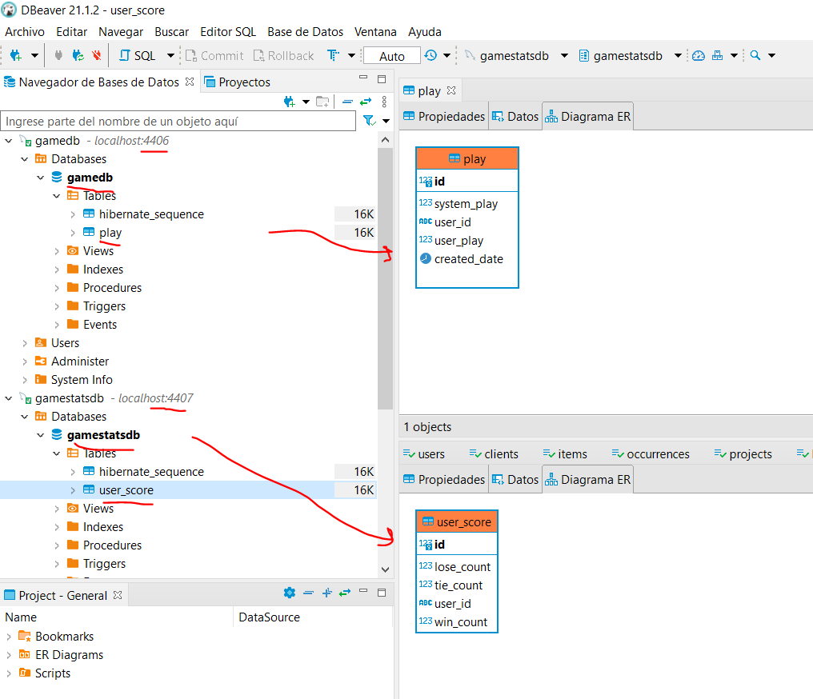

# GOAL

Create a small game of stone, scissors, paper. The user is able to select one of the symbols while the computer (i.e. the enemy) should pick its symbol randomly. The rules are applied and it is displayed which player wins.
Technical
Please implement this as an Application (preferably with a Spring Boot Backend and an Angular Frontend) - use this simple task to show some of your skills, so a little “over-engineering” is totally acceptable here :wink:

# (Solution) APPROACH

### User Interface

### Current Architecture

**BACKEND - 2 backend microservices**

- **game core**: (https://github.com/ravipas87/backendgame), main business logic of the game, and will store all the "plays", user selection, system selection, and some basic auditing data (hence creation date), for further analisys
  -> comunicates with the stats-service, to have aggregated data of users stats (matches wins, lose, and ties), the identification of user is done via a cookie that is set by the frontend (**_Wordle style_**)
  http://localhost:8080/swagger-ui/index.htmlgame-controller
  (url) http://localhost:8080

  (swagger) http://localhost:8080/swagger-ui/index.html

- **stats-service**: (https://github.com/ravipas87/stats_service) holds stats of a user, number of wins/loses/ties
  (url) http://localhost:8081

  (swagger) http://localhost:8081/swagger-ui/index.html

  **TECH STACK**: java17, openapi, swagger, jacoco, springboot 2.7.5, spring actuator, swagger

  **TESTING**: I've tried to implent at least some basics on the diferent layers of the app

  **- service layer**

  **- web layer** (controller/api)

  **- integration testing (e2e)**

**FRONTEND - 2 microfrontends**, **(monorepo)**: https://github.com/ravipas87/frontendgame, following the webpack module federation approach (https://github.com/module-federation/module-federation-examples)

- **game-core**: interacts with the game-core BE microservice
- **game-stats**: interacts with the game-stats BE (this has to be changed putting and API GATEWAY upfront)

  **TECH STACK**: angular12, module federation, yarn

  **TESTING**: I totally neglected this part, there are only test that came with the project template, or created throug **_npm generate ..._**

### Set it up!

1. Download the repos

- **(backend 1)**: https://github.com/ravipas87/backendgame
- **(backend 2)**: https://github.com/ravipas87/stats_service
- **(frontend)**: https://github.com/ravipas87/frontendgame

2. install and run backend
3. install and run frontend

   yarn install

   yarn start:game-core

   yarn start:game-stats

### Desired Architecture (WIP ...)

- [ ] **_API GATEWAY!!!_** in a real env the backend api of the stats-service should be protected hidding it behind an API GATEWAY (Spring Cloud Gateway, K8s...), the main idea was to process the cookie at gateway level
- [ ] **implement modern patterns regard to microservide arch. (service-discovery, circuit breaker, sidecar pattern)**
- [ ] have diferent profiles and envs both in FE and BE (FE right now only works with proxy.conf in local dev)
- [ ] integrate flyway/liquibase
- [ ] review all tests, and think about the api
- [ ] split the docker infra in separated repo (it's own **_dockercompose_** file)

#### C4 - Context Diagram

#### C4 - Component Diagram

### Some Other screenshots

#### Frontend structure

#### API

#### DB

